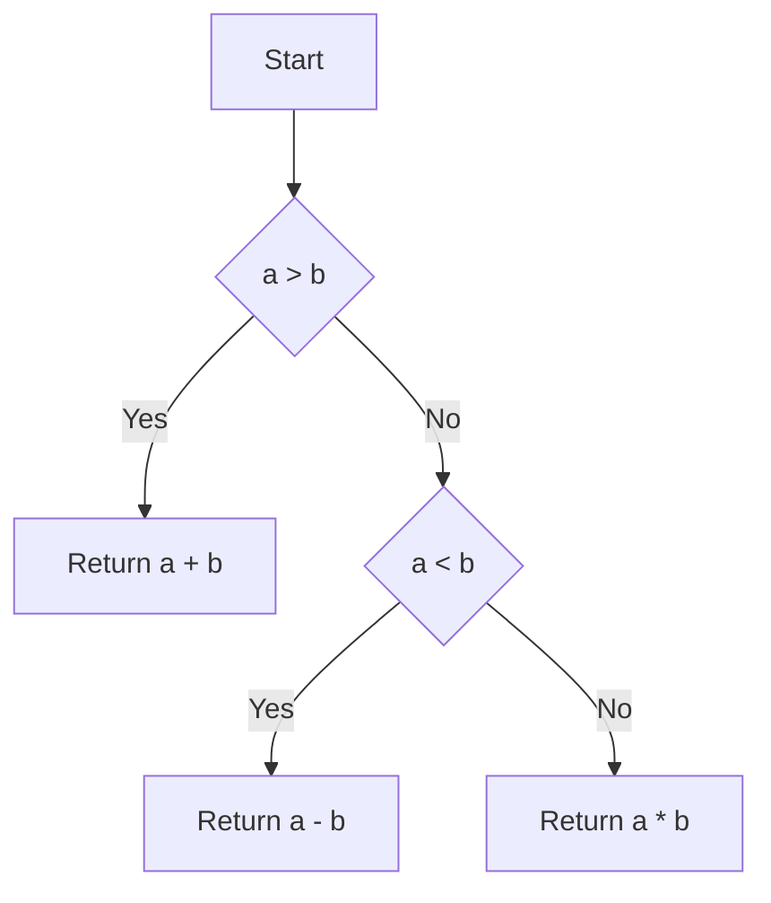

---

# Cyclomatic Complexity Clang Plugin

This repository contains a Clang plugin designed to analyze the **cyclomatic complexity** of C and C++ code. Cyclomatic complexity is a metric used to measure the complexity of a program by counting the number of independent paths through its source code. It helps identify areas in the code that might be overly complex and require additional testing or refactoring.

## Features

- Analyzes the cyclomatic complexity of functions in C and C++ code.
- Generates control flow graphs (CFGs) in `.dot` format.
- Converts `.dot` files into visual representations (PNG images) for better understanding of the code’s flow.
- Simple command-line interface for easy integration into your workflow.

## Build Instructions

Follow the steps below to build the Clang plugin:

1. **Create a build directory** and navigate into it:

    ```bash
    mkdir build && cd build
    ```

2. **Run CMake** to configure the build process:

    ```bash
    cmake ..
    ```

3. **Compile the plugin**:

    ```bash
    make
    ```

After successful compilation, you should see the `libcyclomatic_complexity.so` shared object file in the `build` folder.

## Run Instructions

### 1. Analyze Cyclomatic Complexity

To analyze cyclomatic complexity, run the Clang plugin with a C/C++ source file as input. The plugin will generate cyclomatic complexity values for each function in the code.

```bash
clang -cc1 -load ./libcyclomatic_complexity.so -plugin cyclomatic-complexity ../test/test.c
```

Replace `<source-file>` with the path to your C or C++ source file. The results will include the cyclomatic complexity values for each function in the code.

### 2. Visualize the Control Flow Graph (CFG)

The plugin generates control flow graphs in `.dot` format. You can use `dot`, a part of Graphviz, to convert these `.dot` files into visual representations.

1. Generate a `.png` image from the `.dot` file:

    ```bash
    dot -Tpng complexFunction_cfg.dot -o complexFunction_cfg.png
    ```

This will generate a PNG image of the control flow graph for the function. You can open the image to visualize the flow of the code and the various paths that can be taken.

### Notes:

- You can specify the path to the source file you want to analyze.
- The plugin requires the `-lstdc++` flag to link the C++ standard library.
- The plugin generates reports with the cyclomatic complexity values, stored in `results.cy`.

---

## Example: Cyclomatic Complexity Analysis

Consider the following code snippet to understand cyclomatic complexity:

```cpp
int calculateSum(int a, int b) {
    if (a > b) {
        return a + b;
    } else if (a < b) {
        return a - b;
    } else {
        return a * b;
    }
}
```

In this example:

- The function `calculateSum` takes two integers and returns either their sum, difference, or product.
- There are three decision points (`if`, `else if`, and `else`), which impact the flow of the code.

### Cyclomatic Complexity Calculation:

Cyclomatic complexity (M) is calculated using the formula:

```
M = E - N + 2P
```

Where:

- `E` = number of edges in the control flow graph (number of decision points + 1).
- `N` = number of nodes in the control flow graph (number of statements + 1).
- `P` = number of connected components (1 for a single function).

For this function:

- `E = 4` (three decision points + 1).
- `N = 5` (number of nodes).
- `P = 1` (one connected component for a single function).

Thus, the cyclomatic complexity is:

```
M = 4 - 5 + 2 * 1 = 1
```

### Visualizing the Control Flow Graph

Here is a visualization of the control flow graph for the `calculateSum` function:



This graph represents the possible execution paths based on the conditions in the function. By analyzing the cyclomatic complexity and the control flow graph, you can identify potential areas of the code that might require additional testing or refactoring.

---

## Creating a Command-Line Tool for Cyclomatic Complexity Analysis

You can create a command-line tool to easily analyze cyclomatic complexity in your code. Follow these steps:

### Step 1: Move the Plugin to `/usr/local/bin`

Move the `libcyclomatic_complexity.so` file from your build folder to `/usr/local/bin`:

```bash
sudo mv libcyclomatic_complexity.so /usr/local/bin/
```

### Step 2: Create a Bash Script

Create a new bash script named `cyclomatic-analyser`:

```bash
nano cyclomatic-analyser
```

### Step 3: Add the Bash Script Code

Copy and paste the following script into the `cyclomatic-analyser` file:

```bash
#!/bin/bash

# Check if the input file is provided
if [ -z "$1" ]; then
    echo "Usage: cyclomatic-analyser <source-file>"
    exit 1
fi

# Variables
INPUT_FILE=$1
BASENAME=$(basename "$INPUT_FILE" .c)
PLUGIN="/usr/local/bin/libcyclomatic_complexity.so"  # Updated path to the plugin
SYSROOT_DIR="/usr"  # Adjust this if your system headers are in a different root directory

# Ensure the plugin exists
if [ ! -f "$PLUGIN" ]; then
    echo "Error: Plugin file $PLUGIN not found!"
    exit 1
fi

# Set include paths to system directories
INCLUDE_PATHS="-I/usr/include -I/usr/local/include"

# Run the clang plugin to analyze cyclomatic complexity
clang -cc1 -load "$PLUGIN" -plugin cyclomatic-complexity "$INPUT_FILE" -I"$SYSROOT_DIR/include" -I"$SYSROOT_DIR/lib" 2>/dev/null

# Print which .dot files are generated
echo "Generated .dot files:"
for dot_file in *_cfg.dot; do
    if [ -f "$dot_file" ]; then
        echo "  - $dot_file"
    fi
done

# Find and generate PNG files for each generated .dot file
for dot_file in *_cfg.dot; do
    if [ -f "$dot_file" ]; then
        png_file="${dot_file%.dot}.png"
        echo "Generating PNG for $dot_file ..."
        dot -Tpng "$dot_file" -o "$png_file"

        if [ $? -eq 0 ]; then
            echo "Generated CFG image: $png_file"
        else
            echo "Error generating PNG for $dot_file"
        fi
    fi
done

echo "Cyclomatic complexity analysis completed."
```

Save the file (`Ctrl + O`, then `Enter`) and exit (`Ctrl + X`).

### Step 4: Move the Bash Script to `/usr/local/bin`

Move the `cyclomatic-analyser` script to `/usr/local/bin`:

```bash
sudo mv cyclomatic-analyser /usr/local/bin/
```

### Step 5: Make the Script Executable

Make the script executable by running:

```bash
sudo chmod +x /usr/local/bin/cyclomatic-analyser
```

### Step 6: Create a Test C File

Create a C file, for example, `test.c`, and add your C code snippets to analyze.

### Step 7: Calculate Cyclomatic Complexity

To analyze the cyclomatic complexity of `test.c`, run the following command in your terminal:

```bash
cyclomatic-analyser test.c
```

This will:

- Analyze the code in `test.c`.
- Generate `.dot` files for control flow graphs.
- Convert the `.dot` files into PNG images.
- Display the cyclomatic complexity for each function.

---

## Conclusion

You now have a simple, efficient command-line tool to analyze cyclomatic complexity for any C or C++ code file. By following the instructions above, you can easily integrate this tool into your workflow to improve code quality and testing coverage.

